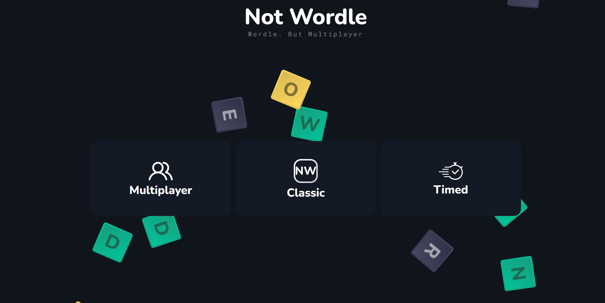

<h1 align="center">
  <br/>
  Notwordle
</h1>
<p align="center">Play <a href="https://www.powerlanguage.co.uk/wordle/" >Wordle</a> <b>without limits</b> on <b>Notwordle</b>.<br/>With<b> multiplayer functionality</b>

<br>
<br>
play my version [on heroku](https://notwordle.herokuapp.com/) or [on my website](https://rimell.cc/notwordle) 

or older versions: [on netlify](https://notwordle.netlify.app) or [on github](https://raaydon.github.io/not-wordle/)

or run locally with [node](https://nodejs.org/en/):

```
npm i
npm run build
npm run server
```
and both the server and webpage are served from [localhost:3001](http://localhost:3001/)

or for development:

```
npm i
npm start
npm run server
```

and go to [localhost:3000](http://localhost:3000) (react scripts will redirect you)



